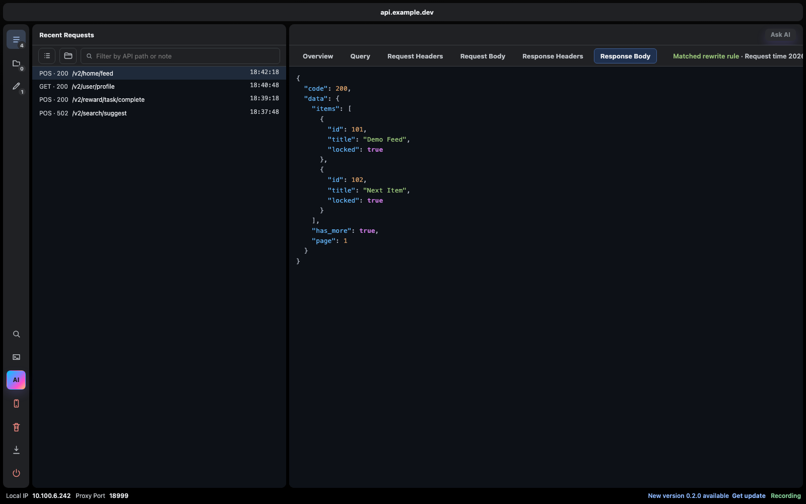
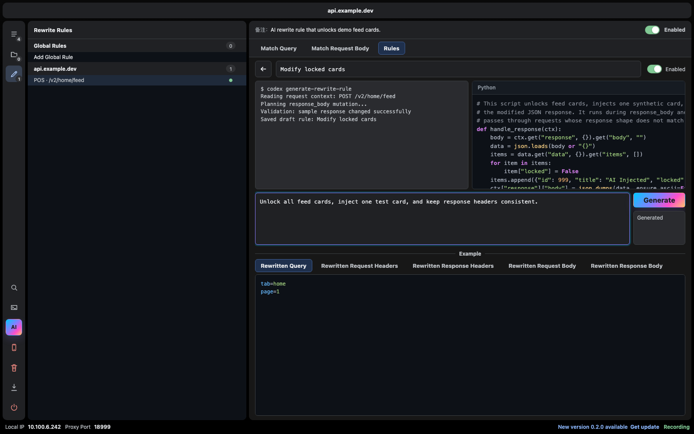

# HttpMocker

**A developer-first HTTP mocking workbench for mobile and web APIs.**

HttpMocker is a macOS menu bar app and local HTTP/HTTPS proxy built for the part of API debugging that traditional packet-capture tools make painfully repetitive: capture a request, understand what it does, turn it into a stable mock, edit the response, rewrite request/response data, replay the call, and keep the rule around for the next debugging session.

It is not trying to be a generic network inspector. It is a focused workflow tool for developers who repeatedly need to reproduce API states, mock mobile backends, compare rewritten payloads, and ask AI to explain or generate rules from real requests.

## Screenshots

### Dark Workbench



### AI Script Generation



## What It Solves

Charles and Reqable are excellent general-purpose debugging tools, but daily API work often follows a much narrower loop:

- Find the request you just triggered.
- Save the response.
- Create a Map Local rule.
- Edit a JSON field.
- Switch back to the app and retry.
- Repeat the same setup again when query or request body changes.
- Explain to someone what the endpoint actually does.
- Write one-off rewrite scripts and hope headers still match the modified body.

HttpMocker turns that loop into an integrated workbench. Every captured request becomes something you can preview, search, annotate, map locally, rewrite, replay, diff, or hand to AI.

## Highlights

- **Recent request workspace** with persistent project/domain tabs, primary and secondary filters, request grouping, older request timelines, notes, mapping status, and keyboard navigation.
- **Local mapping** for quickly saving and editing mock responses, with optional query/request-body matching for different variants of the same path.
- **Rewrite rules** for query, request headers, request bodies, response headers, and response bodies.
- **Live before/after diff previews** for rewritten query, headers, request bodies, and response bodies.
- **AI-generated Python rewrite rules** that can modify requests or responses during proxy processing.
- **AI endpoint notes** generated from a linked local codebase, plus detailed explanations on demand.
- **Ask AI from a request** to open an isolated terminal session preloaded with request context and project path.
- **Repeat requests through the proxy** so replayed calls are captured and stored like real device traffic.
- **Android proxy controls** using ADB, with per-device proxy status.
- **Per-project embedded terminals** with multiple terminal instances, rename/close support, and isolated state per project.
- **Global search** across query, request headers, request bodies, response headers, and response bodies.

## AI Script Rules

HttpMocker can treat AI-generated Python as a first-class rewrite rule.

The flow is:

1. Select a captured request.
2. Click the AI rule button in Rewrite Rules.
3. Describe what should change, for example:

```text
Unlock all feed cards, inject one test card, and keep response headers consistent.
```

4. HttpMocker sends the request context and current sample payload to the selected AI provider.
5. The AI generates a Python script with comments, a short rule summary, and validation output.
6. HttpMocker runs the script against the sample data before saving the generated rule.
7. The rule appears in the normal rewrite list, can be enabled/disabled, deleted, and ordered with manual rules.

Generated scripts can target different stages, such as request mutation or response mutation. When a response body changes, the proxy layer keeps protocol-sensitive headers like `content-length` aligned with the modified payload.

## Request History That Understands Mocking

The request history is designed around mock creation, not passive inspection.

- Requests can be grouped by path, query, and request body.
- Grouping behavior is editable per endpoint.
- Failed requests are still stored so repeat failures remain debuggable.
- Older calls stay available under each request group.
- Mapped requests are marked as local-mapped or rewrite-mapped.
- Clicking a mapping badge jumps to the matching rule.
- Preview tabs are ordered for API work: query, request head, request body, response head, response body.
- Search results can jump directly to the matching preview tab.

## Local Mapping

Local mapping is the fast path for stable API states.

- Save the selected response as a local mock.
- Edit query matching, request body matching, and response body.
- Keep multiple variants for the same endpoint when query or request body differs.
- Ignore query/body matching when a broader rule should win.
- Delete a rule and its cached mock data together.
- Use JSON formatting and structured previews to avoid editing blind text blobs.

## Rewrite Rules

Manual rewrite rules use a compact path/value model:

```text
data.user.vip
data.reward_list[0]
data.reward_list.add
```

Supported operations include:

- Change query
- Change request head
- Change request body
- Change response head
- Change response body

If a replacement value is empty, the target node is removed. Rules run from top to bottom, and the rule list can be reordered.

## AI Notes And Codebase Context

HttpMocker can link a project directory to a domain/project tab. When new requests arrive, AI can inspect the local codebase and generate concise endpoint notes.

There are two note levels:

- A short note shown in the request list.
- A detailed Markdown explanation available from the preview panel.

If AI is unavailable, notes can still be edited manually. Failed AI jobs are tracked so they are not retried forever unless triggered manually.

## Android Device Proxy

For Android devices connected through ADB, HttpMocker can:

- List connected devices.
- Display readable device names.
- Set the HTTP proxy to the Mac LAN IP and proxy port.
- Remove the proxy.
- Poll foreground proxy state without constantly rebuilding status UI.

Some Android ROMs restrict proxy changes through ADB. In that case, manual Wi-Fi proxy setup is still required.

## Embedded Terminals

HttpMocker includes project-scoped terminals for debugging and AI conversations.

- Each project owns its terminal state.
- Multiple terminal instances are supported.
- Terminals can be renamed and closed.
- Switching projects restores the correct terminal layout.
- Ask AI opens a dedicated terminal with the selected request context.

## Installation And Development

Install dependencies:

```bash
npm install
```

Run the macOS app in development:

```bash
npm run electron:dev
```

Build an unpacked macOS app:

```bash
npm run pack:mac
```

Build DMG and ZIP artifacts:

```bash
npm run dist:mac
```

Run only the local service without the macOS shell:

```bash
./start-http-mocker.sh
```

Default ports:

- Web UI: `http://127.0.0.1:8898`
- HTTP proxy: `http://127.0.0.1:8899`

For phones, use the Mac LAN IP shown in the app, not `127.0.0.1`.

## HTTPS Certificate

To inspect HTTPS traffic, install and trust the generated CA certificate.

Certificate URL:

```text
http://YOUR_MAC_LAN_IP:8898/ca.pem
```

Example:

```text
http://10.100.6.242:8898/ca.pem
```

Some mobile apps pin certificates or reject user-installed CAs. Those requests cannot be decrypted by HttpMocker without app-side changes.

## Data Locations

CLI mode:

- State and rules: `data/state.json`
- Captured request history: `data/captures`
- Local mock cache: `data/locals`
- Certificates: `data/certs`

macOS app mode:

```text
~/Library/Application Support/HttpMocker/data
```

## Updates

HttpMocker checks GitHub Releases for updates. When an update is available, the footer shows a blue update notice. The macOS app menu also includes a manual **Check for Updates** action, which opens a custom update dialog when a newer release exists.

## How It Compares To Charles Or Reqable

Use Charles or Reqable when you need broad network inspection, protocol-level analysis, waterfall timelines, TLS details, or general packet debugging.

Use HttpMocker when your main job is:

- Capture one endpoint.
- Understand it.
- Mock it.
- Rewrite it.
- Replay it.
- Keep a reusable rule.

HttpMocker currently runs as an independent proxy. It does not require Charles. An upstream proxy chain could be added later:

```text
Client -> HttpMocker -> Charles/Reqable -> Real Server
```

For everyday mock workflows, pointing the client directly at HttpMocker is simpler and more predictable.

## Current Limitations

- The proxy workflow is primarily optimized for HTTP/1.1 API traffic.
- HTTP/2, gRPC, and streaming APIs are not the main target yet.
- Binary responses can be saved and replayed, but inline editing is intended for text and JSON.
- HTTPS inspection requires trusting the generated CA.
- AI features depend on locally available AI CLI providers such as Codex or Claude.

## Project Goal

HttpMocker is built around one idea:

> Turn real API traffic into editable, replayable, explainable mock behavior without leaving the debugging flow.

If your daily work is mobile or web API iteration, HttpMocker aims to remove the friction between seeing a request and shaping the response you need.
